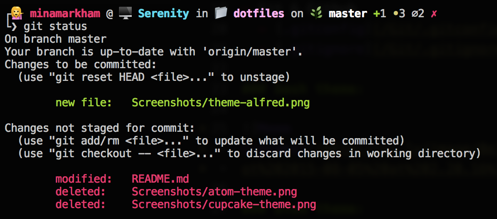
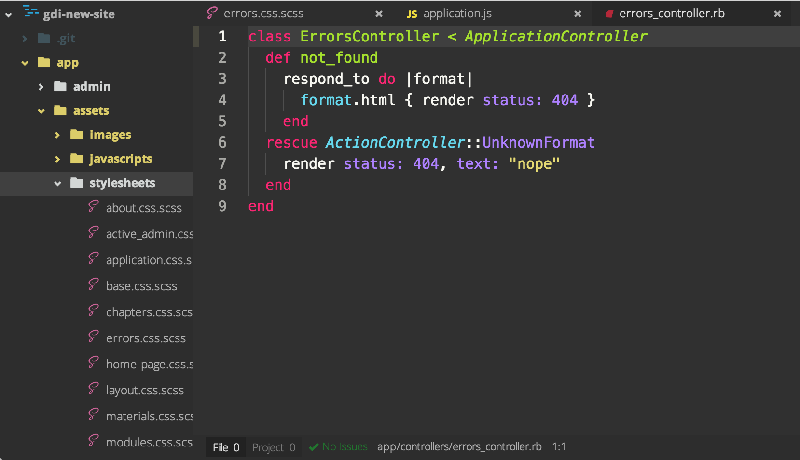
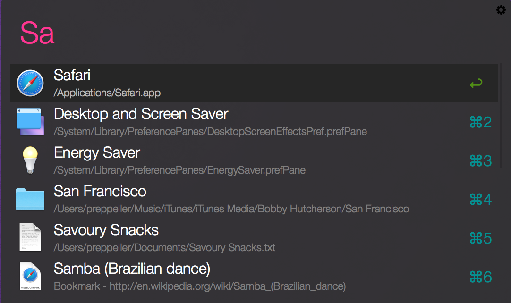

# Dotfiles and Configurations

## ~/.dotfiles

This are my public dotfiles. These are config files to set up a system the way I like it. They might not work for you, but feel free to steal from them.

### index:

- Atom
  - [Atom Plugin List](/Atom/atom-plugins.md)
  - [Settings](/Atom/config.cson)
  - [Dark UI Theme](https://atom.io/themes/dark-flat-ui) (with alterations)
  - [Monokai theme](https://atom.io/themes/monokai) (with alterations)
- Terminal Setup (bash)
  - [Bash It](https://github.com/Bash-it/bash-it)
  - [.bash_profile](/Bash/.bash_profile)
  - [Custom Aliases](/Bash/custom.aliases.bash)
  - [Custom Bash It theme](/Bash/cupcake.theme.bash)
- Git & Github
  - [.gitconfig](/Git/.gitconfig)
  - [.gitignore](/Git/.gitignore)
- Alfred
  - [Monokai Theme](/Alfred/Monokai.alfredappearance)

### bash theme:

### atom theme:

### alfred theme:

